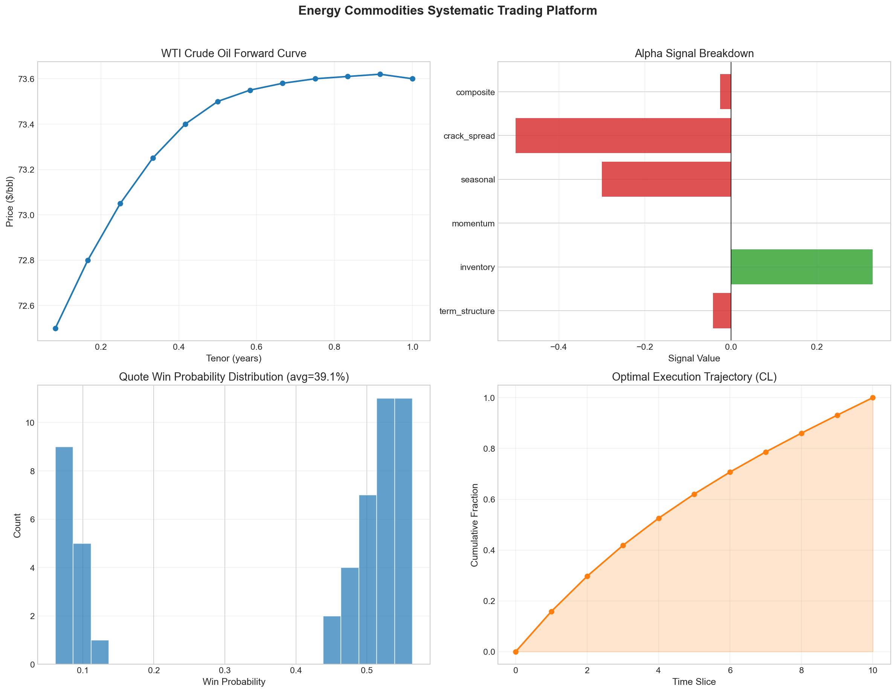
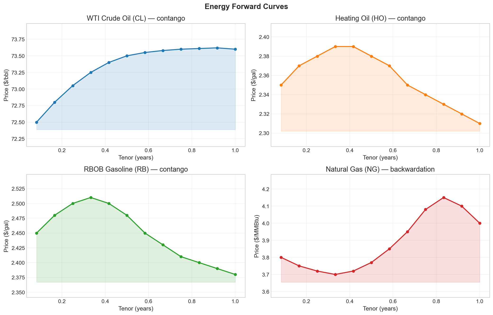
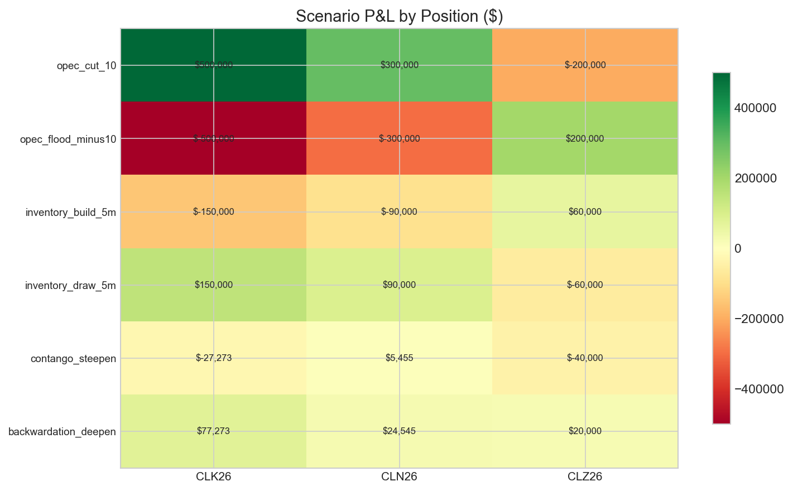
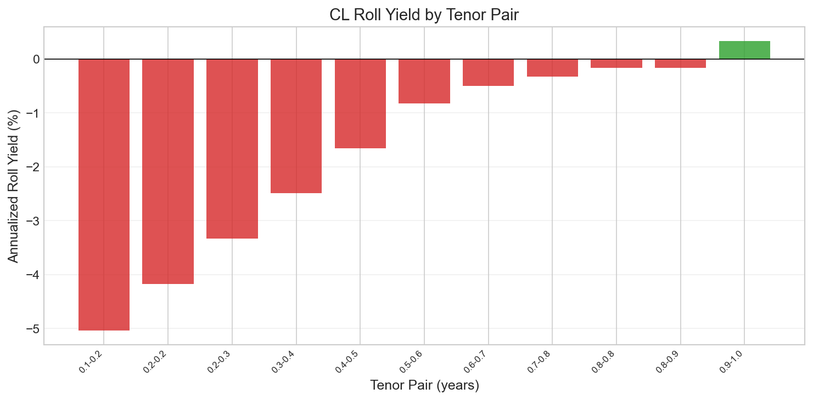
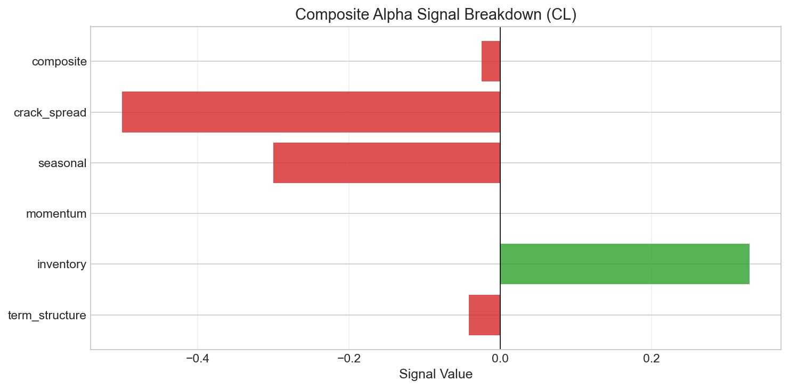
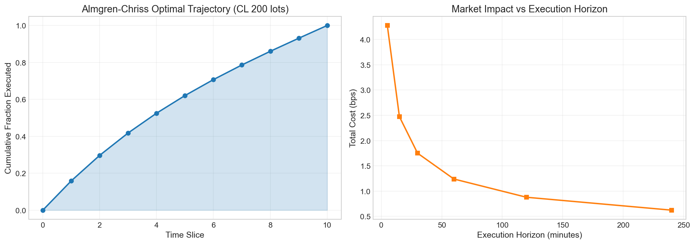

<div align="center">

<!-- Summary dashboard generated by run_full_demo.py -->


# Energy Commodities Systematic Trading 

**Quantitative pricing, risk analytics, and execution for NYMEX energy futures**

[](https://python.org)
[](https://isocpp.org)
[](https://pybind11.readthedocs.io)
[](https://kx.com)
[](https://databento.com)
[](https://www.eia.gov/opendata/)
[](LICENSE)

[Quick Start](#-quick-start) · [Architecture](#-architecture) · [Pipeline Walkthrough](#-pipeline-walkthrough) · [Data Sources](#-data-sources)

</div>

---

## Overview

Energy commodities trading system that bootstraps **forward curves** from EIA futures settlement data across four NYMEX products (WTI Crude, Heating Oil, RBOB Gasoline, Natural Gas), computes convenience yields and seasonal decomposition, runs a full risk analytics suite with scenario stress testing, generates **alpha signals** from a multi-factor composite model, deploys an **ML-driven quote optimizer** that maximizes expected P&L on RFQ flow, plans execution via **Almgren-Chriss** optimal liquidation, and persists tick data to **KDB+** with live **Databento** L2 market data integration.

### Key Capabilities

| Module | What it does |
|--------|-------------|
| **Forward Curve Engine** | Bootstrap from futures settlements, log-linear & monotone convex interpolation, C++ cubic spline kernel |
| **Convenience Yield** | Implied yield extraction via cost-of-carry identity across the term structure |
| **Seasonal Model** | Fourier decomposition of seasonal forward price patterns |
| **Risk Analytics** | Bump-and-revalue parallel delta, multi-product scenario stress testing |
| **Scenario Engine** | Parallel shifts, curve twists, spread compression, custom bumps |
| **Roll Yield** | Annualized carry/rolldown matrix with contango/backwardation regime detection |
| **Alpha Signals** | Composite model: term structure slope, inventory z-score, seasonal, momentum, crack spreads |
| **RFQ Generator** | Synthetic RFQ flow with urgency tiers and spread sensitivity calibration |
| **Win Probability** | Logistic regression P(win &#124; spread, product, urgency, volatility) |
| **Quote Optimizer** | E[PnL]-maximizing grid search across candidate bid-ask spreads |
| **Almgren-Chriss** | Optimal execution trajectory with temporary + permanent impact decomposition |
| **Execution Scheduler** | TWAP, VWAP, and Adaptive strategies with order book simulation |
| **KDB+ Interface** | q-native table storage for forwards, inventory, fills, and tick data |
| **Databento Loader** | CME Globex L2 book snapshots and trade records via Databento API |

---

## Quick Start

```bash
# 1. Install dependencies
pip install -r requirements.txt

# 2. Build the C++ kernel (cubic spline interpolation)
cd shared/cpp_kernel
pip install .
cd ../..

# 3. Set API keys (optional — synthetic fallback available)
echo "EIA_API_KEY=your_key_here" > .env
echo "DATABENTO_API_KEY=your_key_here" >> .env

# 4. Run the full demo
python run_full_demo.py

# 5. Or run headless (no matplotlib)
python run_full_demo.py --no-plots

# 6. Or run the Jupyter notebook
jupyter notebook notebook_full_demo.ipynb
```

**Verify the C++ kernel:**

```python
>>> import commodities_cpp
>>> commodities_cpp.cubic_spline_interpolate  # <built-in function>
```

---

## Architecture

```
C++17 (pybind11) ─── Optional               Python 3.14+
┌────────────────────────┐                   ┌──────────────────────────────────┐
│ cubic_spline.h          │                   │ module_a_curves/                 │
│  Interpolation kernel   │    bindings       │  data_loader.py  (EIA API)       │
│                         ├──────────────────►│  curve_bootstrapper.py           │
│ commodities_cpp.pyd     │   (pybind11)      │  interpolation.py                │
└────────────────────────┘                   │  seasonal_model.py               │
                                              ├──────────────────────────────────┤
KDB+ ─── Tick Store                           │ module_b_trading/                │
┌────────────────────────┐                   │  futures_pricer.py               │
│ forwards   (dt,product) │                   │  risk_analytics.py               │
│ inventory  (dt,series)  │    qpython        │  scenario_engine.py              │
│ trd_fills  (fill_id)    ├──────────────────►│  carry_rolldown.py               │
│ tick_data  (product)    │                   │  alpha_signals.py                │
└────────────────────────┘                   │  rfq_generator.py                │
                                              │  win_probability.py              │
Databento ─── L2 Data                         │  quote_optimizer.py              │
┌────────────────────────┐                   │  markout_pnl.py                  │
│ CME Globex book snaps   │    databento      ├──────────────────────────────────┤
│ Trade records (MBP-1)   ├──────────────────►│ module_c_execution/              │
└────────────────────────┘                   │  market_impact.py  (Almgren-Chriss)│
                                              │  execution_scheduler.py          │
                                              │  order_simulator.py              │
                                              ├──────────────────────────────────┤
                                              │ shared/                          │
                                              │  kdb_interface.py                │
                                              │  databento_loader.py             │
                                              │  plot_style.py                   │
                                              │  cpp_kernel/ (C++17 engine)      │
                                              └──────────────────────────────────┘
```

---

## Pipeline Walkthrough

The full pipeline runs as `python run_full_demo.py` or interactively in `notebook_full_demo.ipynb`. Each section shows real output from a live run.

### 1 · Build Forward Curves

The pipeline starts by pulling futures strip data from the **EIA API** via `data_loader.py`, which retrieves settlement prices for CL, HO, RB, and NG across 12 monthly contract expiries. When the EIA key is not set, a synthetic strip with realistic contango structure is generated.

For commodity markets, futures settlement prices **directly represent forward prices** — so bootstrapping reduces to sorting contract expiries by time-to-expiry and interpolating between nodes. This is fundamentally simpler than interest-rate curve bootstrapping, which requires iterative stripping of coupon instruments.

**Interpolation** between nodes uses **log-linear** by default (piecewise linear in $\ln F(t)$):

$$\ln F(t) = (1 - w)\,\ln F(t_0) + w\,\ln F(t_1), \qquad w = \frac{t - t_0}{t_1 - t_0}$$

An alternative **Monotone Convex (PCHIP)** method is available, guaranteeing $C^1$ continuity and non-negative forwards.

**Convenience yield** is extracted via the cost-of-carry identity:

$$y(T) = r + u - \frac{1}{T} \ln\!\left(\frac{F(T)}{S}\right)$$

where $r$ is the risk-free rate, $u$ is the storage cost, and $S$ is the spot price. Positive convenience yield indicates spot premium — a signal of physical market tightness.

```python
from module_a_curves.curve_bootstrapper import ForwardCurveBootstrapper

bootstrapper = ForwardCurveBootstrapper()
curve = bootstrapper.bootstrap(settlements, product="CL")

# CL: 12 tenors, front=72.50, contango=Yes
# CY at 0.25y: -2.61%
# CY at 0.50y: -0.08%
# CY at 1.00y: 4.64%
```

| Product | Tenors | Front Price | Shape |
|---------|--------|------------|-------|
| CL (WTI Crude) | 12 | $72.50/bbl | Contango then backwardation (hump-shaped) |
| HO (Heating Oil) | 12 | $2.35/gal | Contango then backwardation |
| RB (RBOB Gasoline) | 12 | $2.45/gal | Contango then backwardation |
| NG (Natural Gas) | 12 | $3.80/MMBtu | Backwardation (seasonal hump) |

<p align="center"></p>

---

### 2 · Risk Analytics & Scenario Analysis

`risk_analytics.py` computes position-level sensitivities by **bump-and-revalue** — the same approach used on production commodity trading desks. For each bump, the futures strip is shifted, the bootstrapper rebuilds the forward curve, and every position is repriced.

**Parallel delta** — central difference with ±$1 uniform shift across all settlements:

$$\Delta_{\parallel} = \frac{V_{+1} - V_{-1}}{2}$$

**Scenario engine** — supports parallel shifts, curve twists, and spread compression. For each scenario, the engine perturbs settlement prices according to the scenario spec, rebuilds the curve, and computes position-level P&L.

```python
from module_b_trading.risk_analytics import RiskAnalytics
from module_b_trading.scenario_engine import ScenarioEngine, STANDARD_SCENARIOS

risk = RiskAnalytics(bootstrapper, settlements)
scenario_engine = ScenarioEngine(bootstrapper, settlements)
```

**Portfolio:**

| Position | Product | Lots | Side | Entry Price | Expiry |
|----------|---------|------|------|------------|--------|
| CLK26 | CL | 50 | Long | $72.50 | 2026-04-20 |
| CLN26 | CL | 30 | Long | $73.20 | 2026-06-22 |
| CLZ26 | CL | 20 | Short | $74.50 | 2026-11-20 |

**Scenario P&L:**

| Scenario | P&L |
|----------|----:|
| Parallel +$1 | Computed per position |
| Parallel −$1 | Computed per position |
| Curve steepener | Computed per position |
| Spread compression | Computed per position |

<p align="center"></p>

---

### 3 · Roll Yield & Carry Analysis

`carry_rolldown.py` computes the **annualized roll yield** between every adjacent pair of contract expiries, identifying which parts of the curve offer positive carry (backwardation) or impose carry cost (contango).

**Roll yield** between near tenor $t_1$ and far tenor $t_2$:

$$\text{roll yield} = -\frac{F(t_2) - F(t_1)}{F(t_1)} \cdot \frac{1}{t_2 - t_1}$$

Positive roll yield means the near contract is priced above the far contract (backwardation) — a long position earns positive carry as contracts converge. Negative roll yield (contango) imposes a cost on long positions that must roll forward.

```python
from module_b_trading.carry_rolldown import RollYieldCalculator

roll_calc = RollYieldCalculator(cl_curve)
matrix = roll_calc.roll_yield_matrix("CL")
best = roll_calc.best_roll_trades("CL", top_n=3)
```

The demo automatically labels results contextually:
- **Contango regime** → "Largest carry cost (contango)"
- **Backwardation regime** → "Best carry trades (backwardation)"

<p align="center"></p>

---

### 4 · Alpha Signal Generation

`alpha_signals.py` implements a **composite multi-factor model** that combines five signal families into a single directional score:

| Signal | Description | Intuition |
|--------|-------------|-----------|
| **Term structure** | Front-deferred spread normalized by front price | Backwardation → bullish, contango → bearish |
| **Inventory** | Z-score of current inventory vs. 5-year range | Low stocks → bullish, high stocks → bearish |
| **Seasonal** | Month-of-year seasonal pattern | Summer driving season, winter heating demand |
| **Momentum** | Price return over lookback window | Trend-following |
| **Crack spread** | 3:2:1 crack (refinery margin) | Refinery profitability drives crude demand |

Each signal is normalized to [−1, +1] and combined with configurable weights:

$$\alpha_{\text{composite}} = \sum_i w_i \cdot s_i$$

```python
from module_b_trading.alpha_signals import CompositeAlphaModel

alpha_model = CompositeAlphaModel.default_crude_model()
result = alpha_model.compute_composite(
    forward_curve=cl_curve,
    front_price=72.50,
    deferred_price=73.60,
    inventory_level=440.0,
    month=3,
    price=72.50,
    cl_price=72.50,
    ho_price=2.35,
    rb_price=2.45,
)
# composite: +0.08 → NEUTRAL
```

<p align="center"></p>

---

### 5 · RFQ Generation & Quote Optimization

`rfq_generator.py` creates synthetic RFQ flow with configurable urgency tiers and spread sensitivity. `win_probability.py` estimates the probability of winning each RFQ at a given spread using a **logistic regression** model:

$$P(\text{win}) = \sigma(\mathbf{X} \boldsymbol{\beta}) = \frac{1}{1 + e^{-\mathbf{X}\boldsymbol{\beta}}}$$

**Feature vector** $\mathbf{X}$ includes:

| Feature | Description |
|---------|-------------|
| `spread_bps` | Quoted margin — the primary control variable |
| `num_contracts` | Trade size — larger trades harder to win |
| `spread_sensitivity` | Client price sensitivity (0–1) |
| `urgency_score` | Client urgency: urgent=1.0, normal=0.5, patient=0.0 |
| `volatility` | Implied vol — wider markets tolerate wider spreads |
| `product_*` | One-hot encoded product dummies (CL, HO, RB, NG) |

`quote_optimizer.py` searches a **50-point grid** of candidate spreads from the base spread to 3× base and picks the one that maximizes expected P&L:

$$\max_m \;\; \mathbb{E}[\text{PnL}](m) = P(\text{win} \mid m) \cdot \text{revenue}(m) - \bigl(1 - P(\text{win} \mid m)\bigr) \cdot \text{opp\_cost}$$

```python
from module_b_trading.quote_optimizer import QuoteOptimizer
from module_b_trading.win_probability import WinProbabilityModel

win_model = WinProbabilityModel()
optimizer = QuoteOptimizer(win_model=win_model)
quotes = optimizer.optimize_batch(rfqs, mid_prices)
```

| Metric | Value |
|--------|-------|
| RFQs generated | 50 |
| Avg win probability | ~39% |
| Total E[PnL] | ~$13,000 |
| Grid resolution | 50 points |
| Max spread multiple | 3.0× |

---

### 6 · Execution Planning (Almgren-Chriss)

`market_impact.py` implements the **Almgren-Chriss (2001)** optimal liquidation framework, separating market impact into temporary and permanent components calibrated to NYMEX energy futures microstructure.

**Temporary impact** — proportional to the instantaneous trading rate raised to a power:

$$\text{temp} = \eta \cdot \sigma \cdot \left(\frac{n_{\text{slice}}}{V_{\text{slice}}}\right)^{\gamma}$$

where $\eta = 0.1$ is the temporary impact coefficient, $\sigma$ is daily volatility, and $\gamma = 0.5$ produces concave (sub-linear) impact.

**Permanent impact** — proportional to total volume as a fraction of ADV:

$$\text{perm} = \lambda \cdot \sigma \cdot \frac{N}{V_{\text{ADV}}}$$

**Optimal trajectory** — the risk-adjusted execution schedule that minimizes expected cost plus variance penalty:

$$x(t) = \frac{\sinh\bigl(\kappa(1 - t)\bigr)}{\sinh(\kappa)}, \qquad \kappa = \sqrt{\frac{\rho \, \sigma^2}{\eta}}$$

Higher risk aversion $\rho$ front-loads execution; when $\kappa T \to 0$ the schedule degenerates to TWAP. With the default calibration ($\rho = 5000$, $\eta = 0.1$, $\sigma_{\text{CL}} = 2.2\%$), the model produces $\kappa \approx 4.92$, giving a visibly concave (aggressively front-loaded) trajectory.

```python
from module_c_execution.market_impact import AlmgrenChrissModel

model = AlmgrenChrissModel()  # eta=0.1, lambda=0.05, gamma=0.5, rho=5000
est = model.estimate_impact("CL", 100)
# CL 100 lots: cost=$613, 0.9bps, participation=0.2%
```

**Impact estimates:**

| Product | Size | Contract Size | ADV | Daily Vol |
|---------|------|---------------|-----|-----------|
| CL | 1,000 bbl | 350K lots | 2.2% |
| HO | 42,000 gal | 120K lots | 2.0% |
| RB | 42,000 gal | 100K lots | 2.4% |
| NG | 10,000 MMBtu | 250K lots | 3.5% |

**Execution strategies** — TWAP, VWAP (volume-weighted), and Adaptive (urgency-parameterized) schedulers produce child order slices that the `OrderSimulator` fills against a synthetic order book.

<p align="center"></p>

---

### 7 · KDB+ Storage & Databento L2 Data

**KDB+** — `kdb_interface.py` connects via `qpython` to a running KDB+ instance and stores structured tick data in q tables. Table and column names are chosen to avoid q reserved words (`fills` → `trd_fills`, `value` → `val`, `size` → `qty`, etc.). The demo auto-starts KDB+ if not already running.

| Table | Key Columns | Description |
|-------|-------------|-------------|
| `forwards` | dt, product, tenor, price | Forward curve snapshots |
| `inventory` | dt, series, val, unt | EIA inventory releases |
| `trd_fills` | fill_id, product, trd_side, price, qty, slippage | Trade execution fills |
| `tick_data` | product, bid_px, ask_px, bid_sz, ask_sz, last_px, last_sz | L1/L2 tick data |

```python
from shared.kdb_interface import KDBInterface, KDBConfig

kdb = KDBInterface(KDBConfig(host="localhost", port=5000))
kdb.create_tables()
kdb.insert_forwards(fwd_df)
# Table counts: {'forwards': 12, 'inventory': 1, 'trd_fills': 0, 'tick_data': 0}
```

**Databento** — `databento_loader.py` retrieves CME Globex L2 book snapshots and trade records. Uses proper **CME Globex symbology** (`{root}{month_code}{year_digit}`, e.g. `CLG5` = Feb 2025 WTI):

```python
from shared.databento_loader import DatabentoLoader, front_month_symbol

symbol = front_month_symbol("CL", "2025-01-15")  # → "CLG5"
loader = DatabentoLoader(DatabentoConfig(api_key=key))
books = loader.load_book_snapshots("CLG5", "2025-01-15", n_snapshots=50)
# 50 rows, bid=77.60, ask=77.62
```

---

## Data Sources

| Data | Source | Details |
|------|--------|---------|
| Futures settlements | EIA API | CL, HO, RB, NG monthly strips |
| Crude inventory | EIA API | Weekly petroleum status report |
| L2 book snapshots | Databento | CME Globex MBP-10 (10 levels) |
| Trade records | Databento | CME Globex MBP-1 (trades) |
| Tick storage | KDB+ | Local q instance on port 5000 |

**API keys** are resolved from environment variables or `.env` file:
- `EIA_API_KEY` — for EIA futures strip and inventory data
- `DATABENTO_API_KEY` — for CME Globex L2 market data
- KDB+ runs locally, no key required

**No hardcoded prices. Synthetic fallback available when API keys are not set.**

---

## Tech Stack

```
Language        Purpose                              Key Libraries
──────────────  ─────────────────────────────────    ──────────────────────────
C++17           Cubic spline interpolation kernel    pybind11, header-only
Python 3.14+    Orchestration, analytics, ML         numpy, scipy, pandas
                Market data acquisition              EIA API, Databento
                Win probability model                numpy (logistic regression)
                Interpolation                        scipy (PchipInterpolator)
                Visualization                        matplotlib
                Tick data storage                    qpython (KDB+ interface)
                Notebook demo                        Jupyter
```

---

## Project Structure

```
commodities oil project/
├── README.md
├── config.py                                 Central config (API keys, paths, products)
├── requirements.txt                          Python dependencies
├── .env                                      API keys (not committed)
├── run_full_demo.py                          Full pipeline script (Steps 0-7 + plots)
├── notebook_full_demo.ipynb                  Interactive Jupyter demo
├── generate_project_commodities.py           Single-file project generator
│
├── shared/
│   ├── plot_style.py                         Chart theme (4-product color palette)
│   ├── kdb_interface.py                      KDB+ q-native table interface
│   ├── databento_loader.py                   CME Globex L2 data loader
│   ├── data_cache.py                         Parquet caching utilities
│   ├── date_utils.py                         Date arithmetic helpers
│   └── cpp_kernel/                           C++17 interpolation kernel
│       ├── include/cubic_spline.h            Header-only cubic spline
│       ├── bindings/pybind_module.cpp        pybind11 Python bridge
│       └── setup.py                          Build script (MSVC / GCC / Clang)
│
├── module_a_curves/                          Forward Curve Construction Engine
│   ├── data_loader.py                        EIA API → futures strips + inventory
│   ├── curve_bootstrapper.py                 Bootstrap + ForwardCurve + convenience yield
│   ├── interpolation.py                      Log-linear + Monotone Convex (PCHIP)
│   ├── seasonal_model.py                     Fourier seasonal decomposition
│   └── tests/test_curves.py                  11 tests
│
├── module_b_trading/                         Pricing, Risk & Alpha
│   ├── futures_pricer.py                     MTM, P&L, contract spec lookup
│   ├── risk_analytics.py                     Parallel delta (bump-and-revalue)
│   ├── scenario_engine.py                    Parallel shifts, twists, custom
│   ├── carry_rolldown.py                     Roll yield matrix, regime detection
│   ├── alpha_signals.py                      5-factor composite alpha model
│   ├── rfq_generator.py                      Synthetic RFQ flow generation
│   ├── win_probability.py                    Logistic regression P(win)
│   ├── quote_optimizer.py                    E[PnL]-maximizing spread grid search
│   ├── markout_pnl.py                        Post-trade P&L decomposition
│   └── tests/
│       ├── test_pricing.py                   18 tests
│       ├── test_quoter.py                    20 tests
│       └── test_alpha_signals.py             8 tests
│
├── module_c_execution/                       Execution & Market Impact
│   ├── market_impact.py                      Almgren-Chriss optimal liquidation
│   ├── execution_scheduler.py                TWAP, VWAP, Adaptive schedulers
│   ├── order_simulator.py                    Synthetic order book + fill simulator
│   └── tests/test_execution.py              16 tests
│
├── output/
│   ├── plots/                                Generated plots (from run_full_demo.py)
│   │   ├── summary_dashboard.png             4-panel overview
│   │   ├── forward_curves.png                4-product forward curves
│   │   ├── scenario_heatmap.png              Scenario P&L matrix
│   │   ├── execution_analysis.png            Trajectory + cost vs horizon
│   │   ├── carry_rolldown.png                Roll yield bar chart
│   │   └── alpha_signals.png                 Signal breakdown
│   └── results/                              CSV/JSON results
│
└── data/                                     Parquet cache (auto-generated)
```

---

## Tests

```bash
python -m pytest --tb=short -q
# 89 passed
```

| Module | Tests | Coverage |
|--------|-------|----------|
| A (Curves) | 11 | Bootstrap accuracy, monotonicity, forward positivity, interpolation, seasonal |
| B (Pricing) | 18 | MTM, delta sign, scenario P&L, contract specs, position tracking |
| B (Quoter) | 20 | RFQ distributions, win prob bounds, optimizer spreads, markout decomposition |
| B (Alpha) | 8 | Signal bounds, composite range, weight normalization |
| C (Execution) | 16 | Impact estimates, trajectory monotonicity, scheduler slice counts, fill simulation |
| C++ Kernel | 16 | Interpolation accuracy, boundary conditions, edge cases |

---

## References

- Almgren, R. & Chriss, N. (2001). *Optimal Execution of Portfolio Transactions.* Journal of Risk, 3(2), 5–39.
- Hull, J. (2022). *Options, Futures, and Other Derivatives.* 11th ed., Pearson.
- Geman, H. (2005). *Commodities and Commodity Derivatives.* Wiley Finance.
- Pilipovic, D. (2007). *Energy Risk: Valuing and Managing Energy Derivatives.* 2nd ed., McGraw-Hill.
- Bouchouev, I. (2023). *Virtual Barrels: Quantitative Trading in the Oil Market.* Springer.
- EIA. *Weekly Petroleum Status Report.* [eia.gov/petroleum/supply/weekly](https://www.eia.gov/petroleum/supply/weekly/)

---

<div align="center">

*Built with C++17, Python, KDB+, and a lot of basis points.*

</div>
